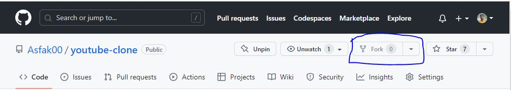

# How it's work?

https://github.com/Asfak00/toast-message-modal/assets/108581106/ac5a725d-6f8e-4017-a921-938a0cef3b5b

# How to use this template? Follow below steps....

# 1. fork this repository.



# 2. Clone this repository to your local machine

```
> git clone https://github.com/Asfak00/toast-message-modal.git
```

# 3. Run code with live server


</br>

# 4. Add those codes in the index.css file to your project's CSS file

```css
/* toast container */
#toastContainer {
  position: fixed;
  top: 5%;
  right: -300px;
  visibility: hidden;
  opacity: 0;
  background-color: rgba(143, 199, 255, 0.581);
  padding: 0.9rem 1rem;
  border-radius: 5px;
  transition: all 0.3s ease-in-out;
  cursor: pointer;
  border: 1px solid rgb(6, 70, 247);
}
```

> These are the design code of the toast message container

</br>

# 5. Add these codes in the app.js file to your project's JS file

```js
// show toast button & toast container element reference
const showToastMessage = document.getElementById("showToastMessage");
const toastContainer = document.getElementById("toastContainer");

// show toast button with adding click event
showToastMessage.addEventListener("click", () => {
  toastContainer.style.right = "2%";
  toastContainer.style.visibility = "visible";
  toastContainer.style.opacity = "1";
});

// toast container with adding click event
toastContainer.addEventListener("click", () => {
  toastContainer.style.right = "-300px";
  toastContainer.style.visibility = "hidden";
  toastContainer.style.opacity = "0";
});
```

> These are all the JS code for the toast message to appear and for it to go away again when someone clicks on the toast message. You will add these codes to your project's JS file.

</br>

# 6. Add this ID where you want to show the tost message when clicked..

```html
<button id="showToastMessage">Show Toast Message</button>
```

> The toast message will basically fire when someone click a button. So you need to use the click event in the place where you want to show the toast message when you click on the page and the id given by us should be given to the element that uses that click event

</br>

# 7. Now you cna change the code in the CSS file to customize the toast message notification box.

</br>

- are you like this project please give me a star for make more interesting design/component for you!
